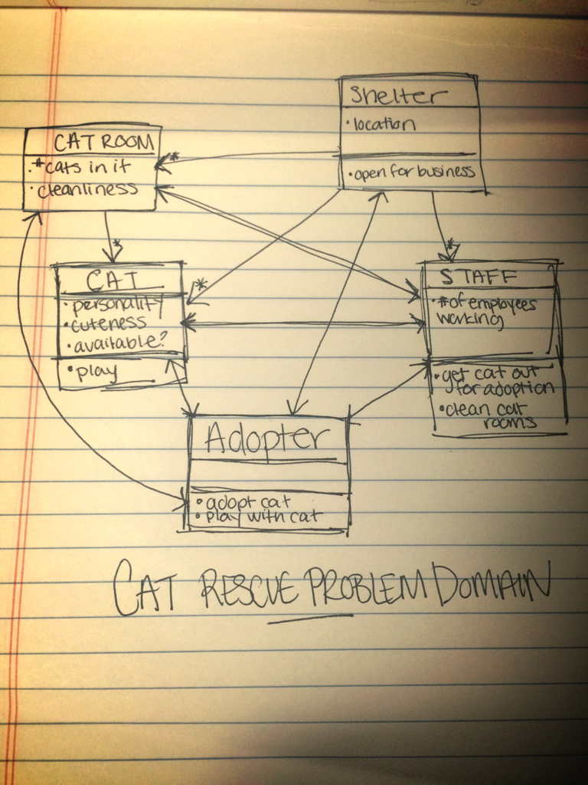

# problemDomain
Use object oriented design to model a problem domain.

A Cat Rescue Shelter.

A person who wants to adopt a cat is an adopter. They look for cat shelters close to them. The Shelters have cats. Each cat has varying degress of cuteness, different personalities, and different ages. After picking a distace, the adopter can search for cats by age and personality. The adopter gets to go home with a happy kitty!

 "UML Class Diagram - this was the original diagram that got scaled down for the actual site"

